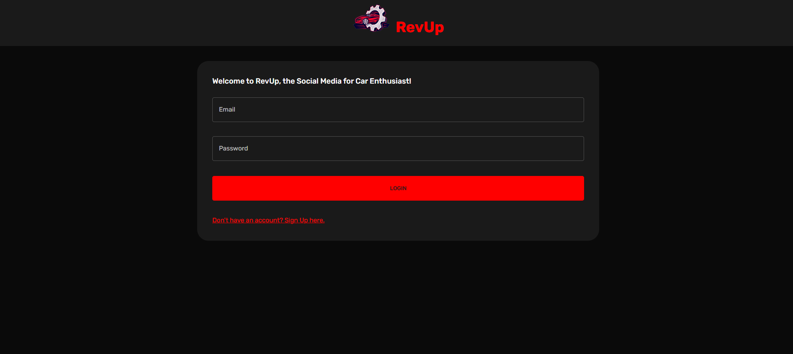
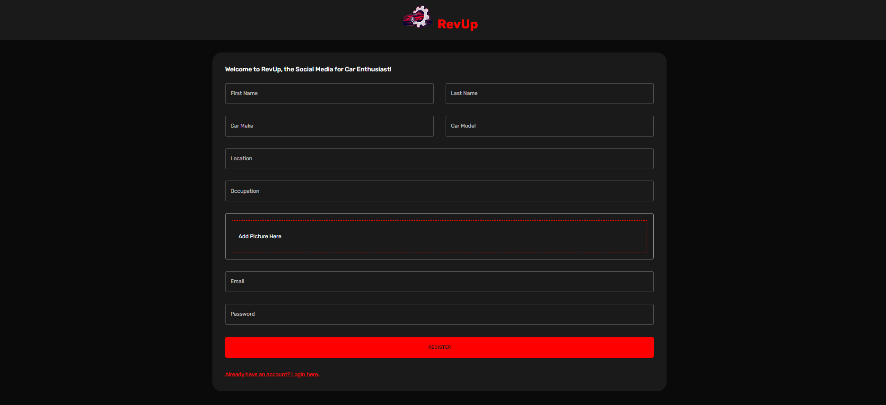
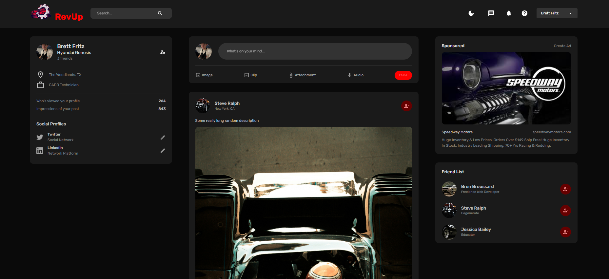
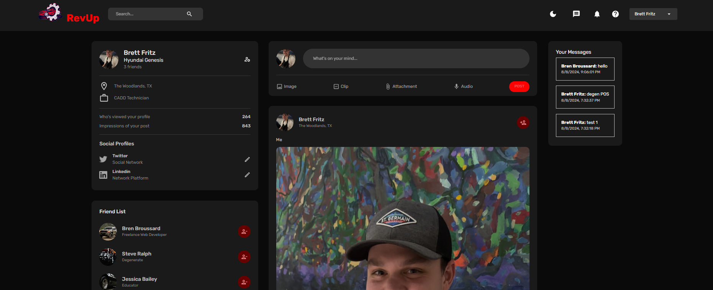

# RevUp

RevUp is a brand new social media app built for motor enthusiasts. We bring you a whole new way for you to show off your builds, flex on your friends, and connect with like-minded gear heads.

## Table of Contents

- [Demo/Description](#demo/description)
- [Features](#features)
- [Technologies Used](#technologies-used)
- [Setup Instructions](#setup-instructions)
- [License](#license)

## Demo/Description

1. In order to get started, paste the following link in your browser in order to navigate to the website. As there is no current link to live deployment, download the repository, and simply run `npm install && npm start` in the root folder to run the app on your local machine.

2. Upon loading you'll be greeted with our login page where there is a button for you to sign in.

3. If you don't already have an account, click the signup button

4. After clicking the signup button, you will be prompted to fill in your profile information to get your account started.

5. Once you have successfully signed up and/or logged in if you are revisiting, you will be redirected to your feed. here you will see posts from all of your friends and pages that you follow like other social medi pages. From here, you are able to interact with posts and profiles to like, read comments, add friends, send messages, and other key features.

6. On the left side of the page you will notice your profile information is displayed for you to see. From there, if you click on your name, you will be taken to your profile page. You will be able to make new posts, and update your profile information.

7. The app functions as other social media pages, feel free to explore and make it yours!

## Features

- Post feed to display relevent posts to your profile
- Post and profile interactions
- Unique profile for each user
- Direct messaging to individual users.
- Sign Up funtionallity.
- Login and Logout functionallity

## Technologies Used

- HTML
- CSS
- Javascript
- Node.js
- Express.js
- bcrypt.js
- JSON Web Tokens
- MongoDB
- Mongoose
- React.js
- GraphQL
- Git
- Github
- JSON
- npm

## Setup Instructions

Simply follow the first steps found in the [Demo/Description](#demo/description) section of this ReadMe.

## Contributors

Bren Broussard - Repositories: https://github.com/brenj23?tab=repositories

Brett Fritz - Repositories: https://github.com/brettfritz?tab=repositories

## Links
Cash Compass Repository: https://github.com/brenj23/revup-MERN

RevUp Live Website: *Coming Soon*

## License

MIT License
